# Sistema Frontend para Gestión de CENDIS

Este proyecto es una aplicación web desarrollada en Angular para la gestión del sistema P004-AG-Cendis. Permite a los usuarios interactuar con los diferentes módulos del sistema de manera visual, intuitiva y organizada.

Encargado de la experiencia de usuario (UI/UX), consumo de la API y visualización de la información relacionada con usuarios, insumos, pedidos y operaciones de los CENDIS.

---

## Características

- Interfaz moderna, responsiva y fácil de usar
- Sistema modular por áreas funcionales
- Gestión completa mediante operaciones CRUD
- Visualización de información en tiempo real
- Integración con backend mediante API REST

---

## Módulos del sistema

### Administración
- Usuarios
- Accesos
- Movimientos de insumos
- Cargos
---

### Catálogo
- CENDIS
- Rango de edades
- Horarios
- Presentaciones
- Unidades

Todos los módulos son CRUD  
Al crear un CENDI, se generan automáticamente los insumos en su almacén

---

### Cocina
- Catálogo de insumos: Insumos utilizados en los CENDIS, Al crear un insumo, se genera automáticamente en todos los almacenes

- Almacén de insumos
- Recetas y menús

---

### Pedidos
- Generación automática de pedidos
- Cálculo basado en:
  - Rango de edades
  - Cantidad de niños
  - Menú asignado en calendario

Los cálculos se realizan automáticamente

---

### Calendario

- Asignación de menús por CENDI
- Base para la generación de pedidos

---

### Impresiones

  - Insumos por menú
  - Detalles de pedidos
  - Reportes por rango de fechas (acumulados)

---

## Tecnologías

### Frontend (FrontEND)
- Framework : Angular
- Lenguaje : TypeScript
- Estilos : CSS
- Comunicación : HttpClient (consumo de API REST)

---

## Ejecución local

```bash
cd FrontEND
npm install
ng serve
```

## Vista previa

<p align="center">

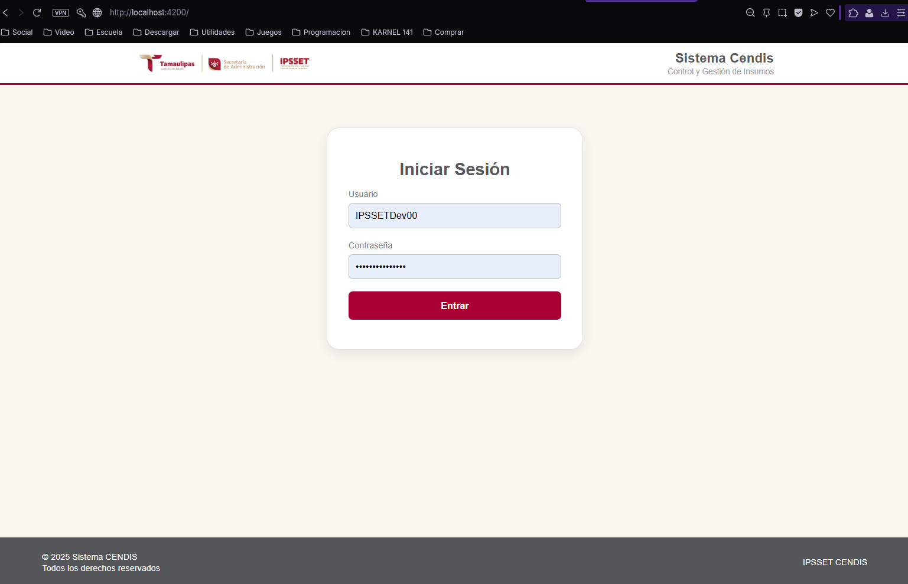
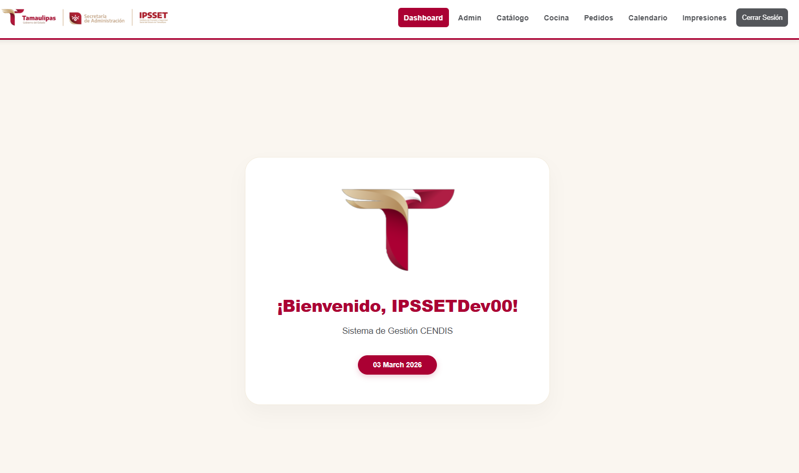
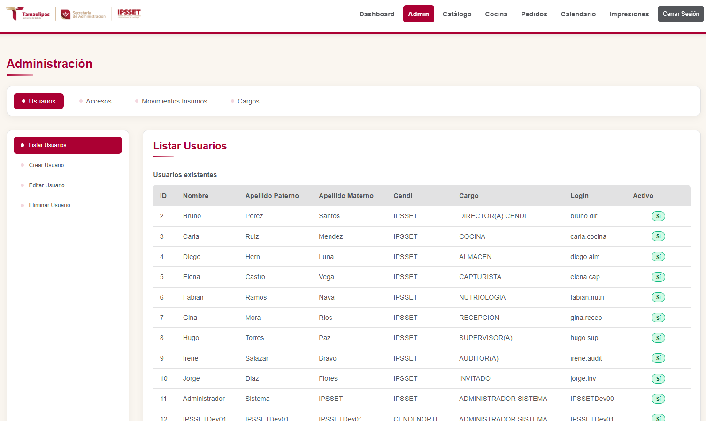
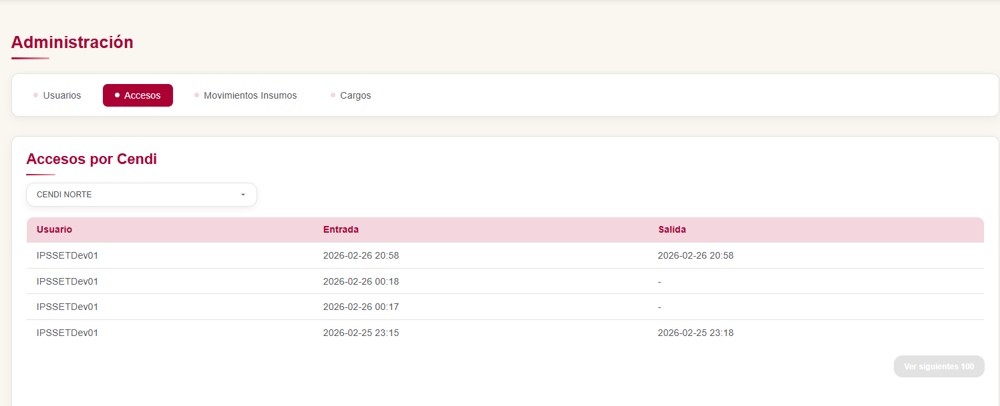
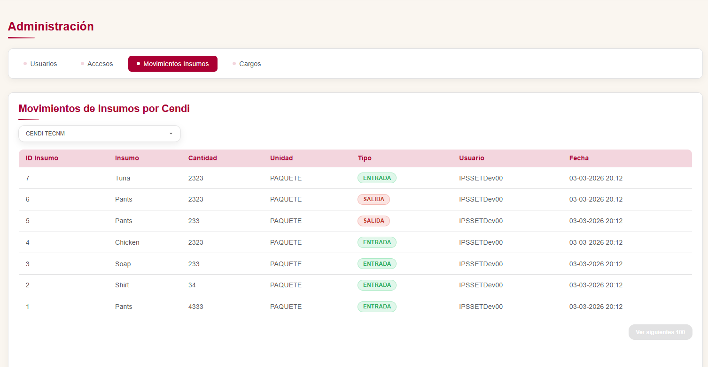
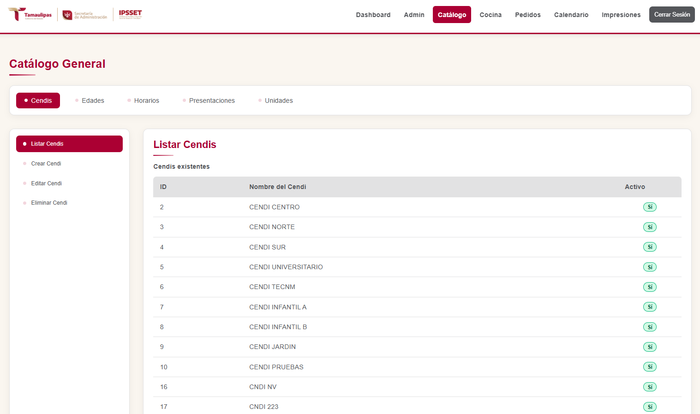
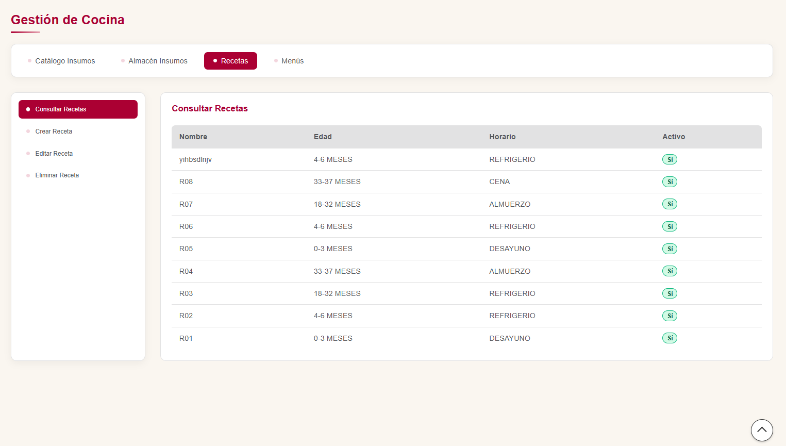
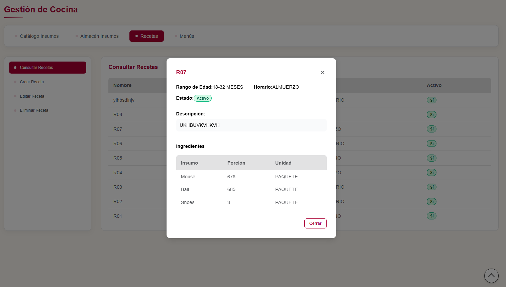
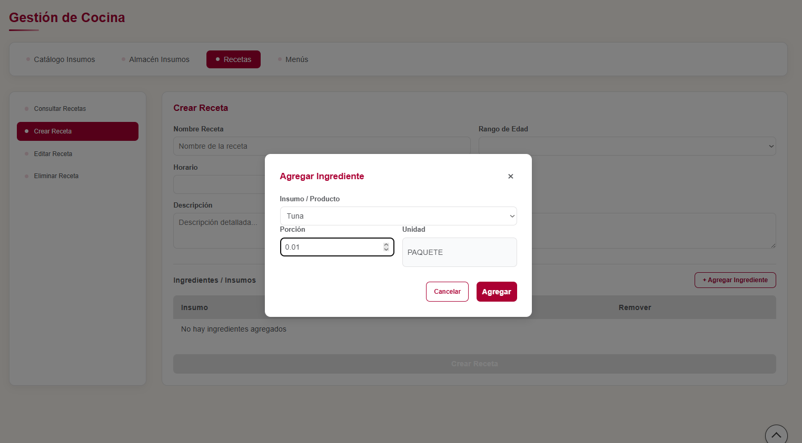
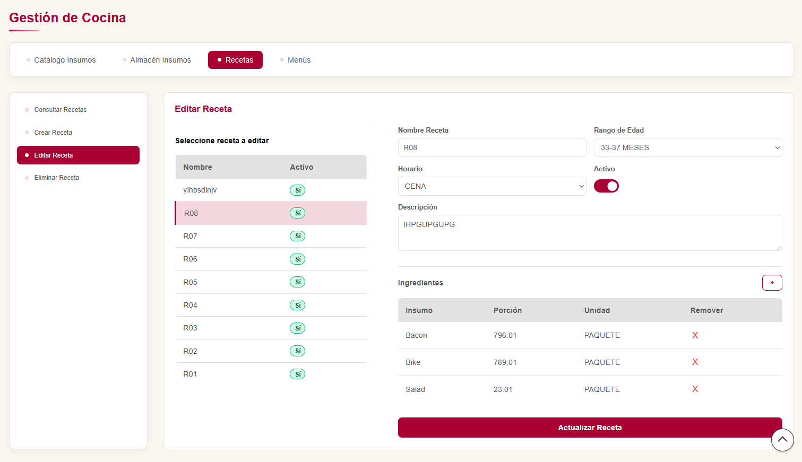
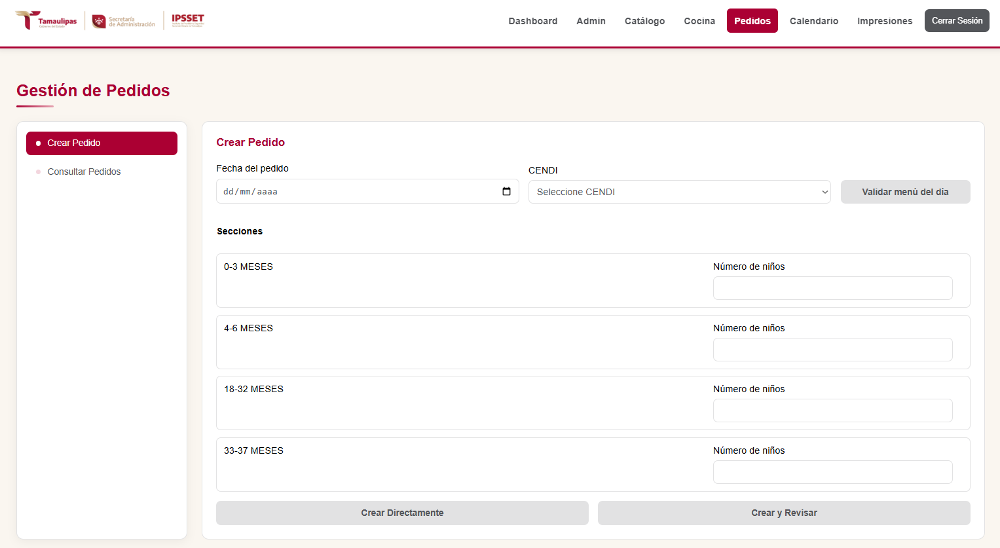
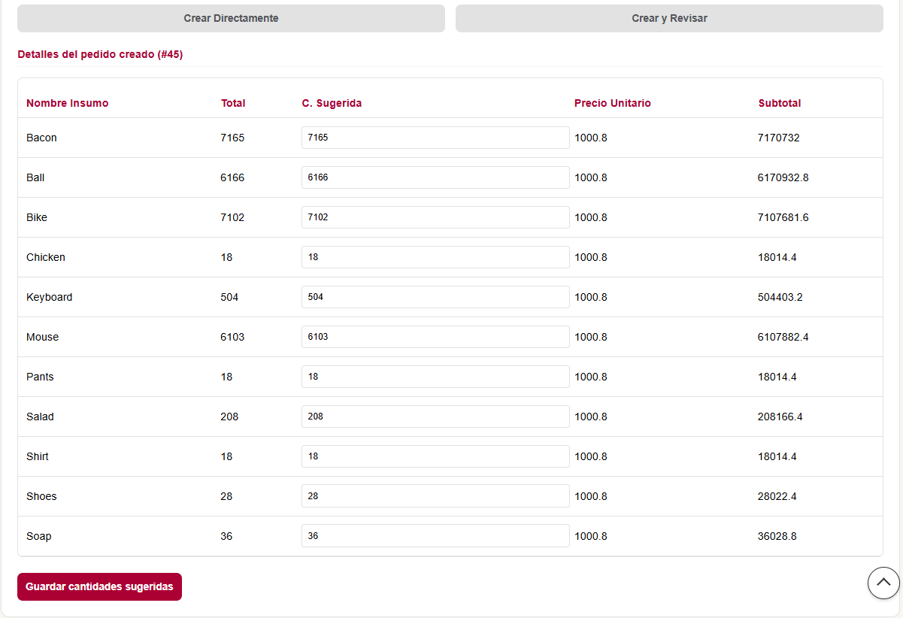
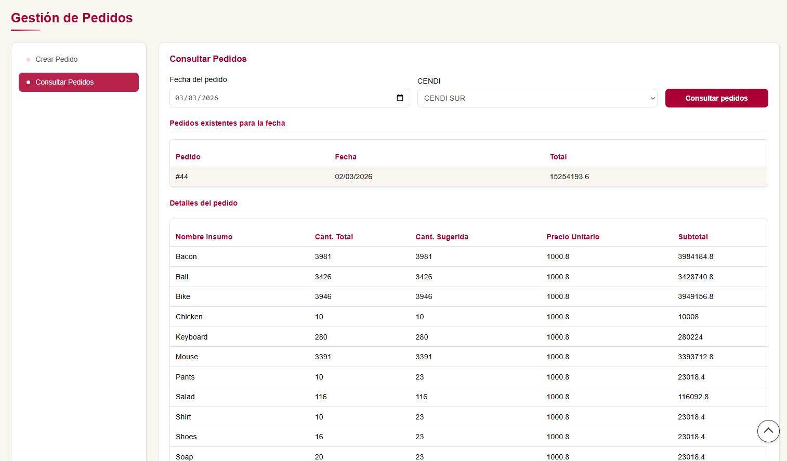
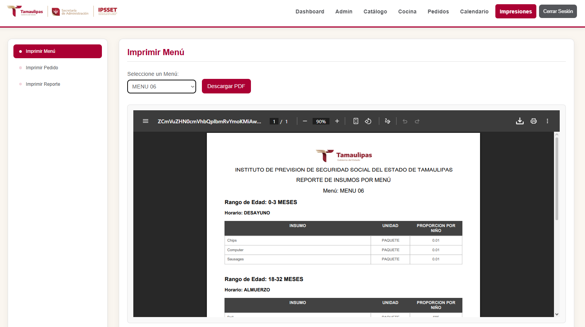
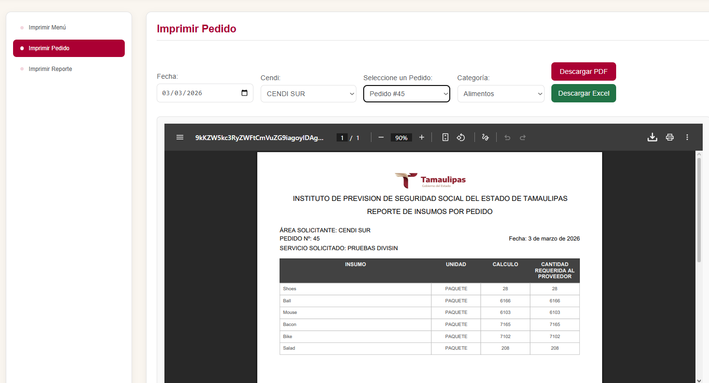
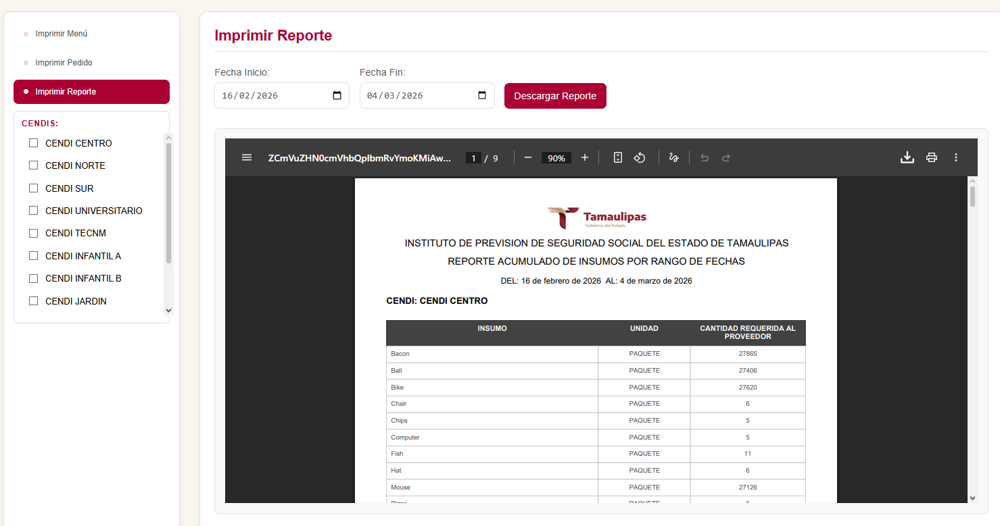
</p>


## Development server

To start a local development server, run:

```bash
ng serve
```

Once the server is running, open your browser and navigate to `http://localhost:4200/`. The application will automatically reload whenever you modify any of the source files.

## Code scaffolding

Angular CLI includes powerful code scaffolding tools. To generate a new component, run:

```bash
ng generate component component-name
```

For a complete list of available schematics (such as `components`, `directives`, or `pipes`), run:

```bash
ng generate --help
```

## Building

To build the project run:

```bash
ng build
```

This will compile your project and store the build artifacts in the `dist/` directory. By default, the production build optimizes your application for performance and speed.

## Running unit tests

To execute unit tests with the [Karma](https://karma-runner.github.io) test runner, use the following command:

```bash
ng test
```

## Running end-to-end tests

For end-to-end (e2e) testing, run:

```bash
ng e2e
```

Angular CLI does not come with an end-to-end testing framework by default. You can choose one that suits your needs.

## Additional Resources

For more information on using the Angular CLI, including detailed command references, visit the [Angular CLI Overview and Command Reference](https://angular.dev/tools/cli) page.
